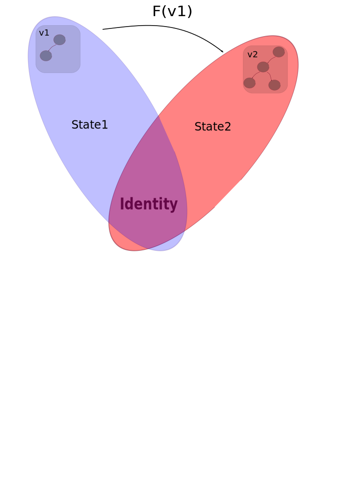

!SLIDE subsection

# Clojure

!SLIDE center
.notes 
* Value: an immutable magnitude, quantity, number, or composite of these
* Identity: a putative entity we associate with a series of causally related values (states) over time
* State: value of an identity at a moment in time
* Time: relative before/after ordering of causal values.

# Value identity state and time

