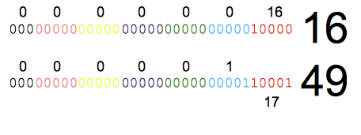

!SLIDE bullets 

# Persistent data structures

* Implemented as 32 bit partitioned trees
* Immutable
* Data sharing 

!SLIDE code style execute
# Immutability 

    @@@ clojure
    (def a [1 2 3])
    
    (conj a 4)

    (println a)

!SLIDE full-page-image

!SLIDE full-page-image

!SLIDE code small

# Nth 
.notes an explanation on the binary bits should come first

    @@@ java
    public Object nth(int i){
            ensureEditable();// transient access
            Object[] node = arrayFor(i);
            return node[i & 0x01f];
    } 

    private Object[] arrayFor(int i){
          if(i >= 0 && i < cnt) {
             if(i >= tailoff())
                return tail;
             Node node = root;
             for(int level = shift; level > 0; level -= 5)
               node = (Node) node.array[(i >>> level) & 0x01f];
               return node.array;
             }
           throw new IndexOutOfBoundsException();
     } 
