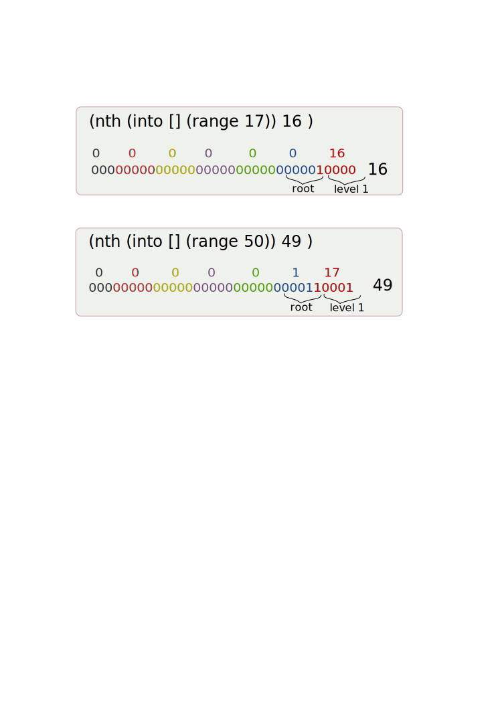

!SLIDE bullets 
.notes Clojure takes immutability one step further
# Persistent data structures

* Implemented as 32 bit partitioned trees
* Immutable
* Data sharing 

!SLIDE code style execute
.notes Here we see that the original value hasn't changed
# Immutability 

    @@@ clojure
    (def a [1 2 3])
    
    (conj a 4)

    (println a)

!SLIDE full-page-image
.notes Clojure ADT are implemented as 32bit partitioned trees, in this case we see the tree of a vector

!SLIDE center
.notes The binary partitioning scheme is to divide each level in the tree into 

!SLIDE code small
.notes arrayFor is looking for the matching level node, the loop goes through 5 bits at a time shifting 
# Nth 

    @@@ java
    public Object nth(int i){
            ensureEditable();// transient access
            Object[] node = arrayFor(i);
            return node[i & 0x01f];
    } 

    private Object[] arrayFor(int i){
          if(i >= 0 && i < cnt) {
             if(i >= tailoff())
                return tail;
             Node node = root;
             for(int level = shift; level > 0; level -= 5)
               node = (Node) node.array[(i >>> level) & 0x01f];
               return node.array;
             }
           throw new IndexOutOfBoundsException();
     } 
