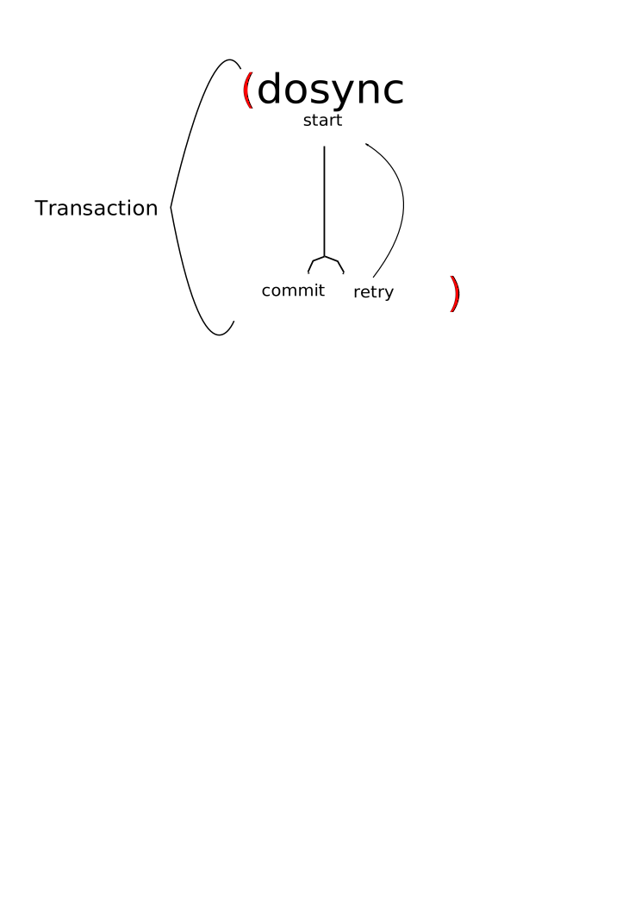

!SLIDE bullets incremental transition=fade
# Refs

* Coordinated storage using STM
* Mutation: ref-set, alter, commute 

!SLIDE bullets incremental transition=fade
.notes "Atomic" commit or retry, "Consistent" constraints on the data will not be violated, "Isolated" changes made inside a transaction are not visible outside the transaction until it commits
# Transactions 
* A unit of work
* ACI(D)
* Should be side effect free (retries)

!SLIDE center
.notes commit if successful, retry if conflict (up to RETRY_LIMIT currently 10,000), this is a simplification of the real life cycle which has 5 states
# Life cycle

!SLIDE code execute
.notes A basic alter example

    @@@ clojure
    (def account (ref 0))

    (defn deposit [amount]
      (alter account #(+ amount %)))

    (def f (future (dosync (deposit 5))))
     
    (do 
      (deref f)
      (println @account))
    

!SLIDE code execute
.notes ref-set usage is frowned upon alter is preferable

    @@@ clojure
    (def account (ref 0))

    (def f 
      (future 
        (dosync 
         (ref-set account (+ 5 @account)))))
     
    (do 
      (deref f)
      (println @account))
    
!SLIDE code execute small
.notes Here we how see an example for retries (T2 retries couple of times), this can be prevented in this case since + is commutative

    @@@ clojure
    (alter-var-root #'*out* (constantly *out*))

    (def account (ref 0))

    (defn deposit [amount] (alter account + amount ))

    (def f1 (future 
          (dosync
             (deposit -2)
             (Thread/sleep 500)
             (println (str "T1 running") @account)
             (deposit 5))))

    (def f2 (future 
          (dosync
             (println (str "T2 running") @account)
             (deposit 5))))
     
    (do 
      (deref f1)
      (deref f2)
      (println @account))
    
!SLIDE code execute small 
.notes commute, here we use commute on a commutative operation (+) in order to avoid retries. 

    @@@ clojure
    (alter-var-root #'*out* (constantly *out*))

    (def account (ref 0))

    (defn deposit [amount] (commute account + amount))

    (def f1 (future 
          (dosync
             (deposit -2)
             (Thread/sleep 500)
             (println (str "T1 running") @account)
             (deposit 5))))

    (def f2 (future 
          (dosync
             (println (str "T2 running") @account)
             (deposit 5))))
     
    (do 
      (deref f1)
      (deref f2)
      (println @account))

!SLIDE code execute smaller
.notes Write skew example http://paste.lisp.org/display/87117#1

    @@@ clojure
    (alter-var-root #'*out* (constantly *out*))

    (def account1 (ref 100))
    (def account2 (ref 100))

    (defn deposit  [account amount]
      (dosync
        (if (> (+ @account2  @account1) 0)
          (alter account + amount))))

    (let [deposits1 (repeat 10 #(deposit account1 -200)) 
          deposits2 (repeat 10 #(deposit account2 -200))]
      (dorun (apply pcalls (interleave deposits1 deposits2)))
      (println @account1)
      (println @account2))

!SLIDE code execute smaller
.notes Here we use ensure to prevente the write skew issue

    @@@ clojure
    (alter-var-root #'*out* (constantly *out*))

    (def account1 (ref 100))
    (def account2 (ref 100))

    (defn deposit  [account amount]
      (dosync
        (ensure account1)
        (ensure account2)
        (if (> (+ @account2  @account1) 0)
          (alter account + amount))))

    (let [deposits1 (repeat 10 #(deposit account1 -200)) 
          deposits2 (repeat 10 #(deposit account2 -200))]
      (dorun (apply pcalls (interleave deposits1 deposits2)))
      (println @account1)
      (println @account2))

