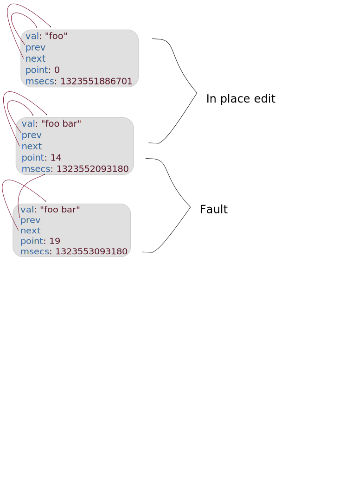

!SLIDE subsection
# Ref

!SLIDE code small
.notes each Ref stores multiple versions of committed values in a circular list tvals
# Ref

    @@@ java
    public class Ref extends ARef implements IFn, Comparable<Ref>, IRef{ 
     ...

     public static class TVal{
       Object val;// the committed value
       long point;// transaction commit id
       long msecs;// TVal creation time
       TVal prior;// older commits
       TVal next;// newer commits
     } 
   
     TVal tvals;
     ...
    }

!SLIDE center
.notes Values are added if faults happend
# Ref history list

!SLIDE bullets incremental transition=fade
# Fault

* A TX read a ref that has no local value
* All existing values were commited after TX has began
* This causes a retry and tvals grow

!SLIDE bullets incremental transition=fade
.notes Barging favors old transactions 
# Write conflict and Barging

* TX A try modifying a Ref that B changed without committing
* A will try to Barge B

!SLIDE code small
.notes 
In order for A to barge B (else A will retry):
1. A must have been running for at least 1/100th of a second (BARGE_WAIT_NANOS)
2. A started before B (favors older txns)
3. B has a status of RUNNING and can be changed to KILLED
# Barge 

    @@@ java
    private boolean barge(Info refinfo){
      boolean barged = false;
      // if this transaction is older
      // try to abort the other
      if(bargeTimeElapsed() && startPoint < refinfo.startPoint)
            {
        barged = refinfo.status.compareAndSet(RUNNING, KILLED);
        if(barged)
            refinfo.latch.countDown();
            }
      return barged;
    }  

    Object run(Callable fn) throws Exception{ 

       // within the retry loop      
      Info refinfo = ref.tinfo; 
      if(refinfo != null && refinfo != info && refinfo.running())
           {
             if(!barge(refinfo))
                throw retryex;
           }  
       ...
      
    }

